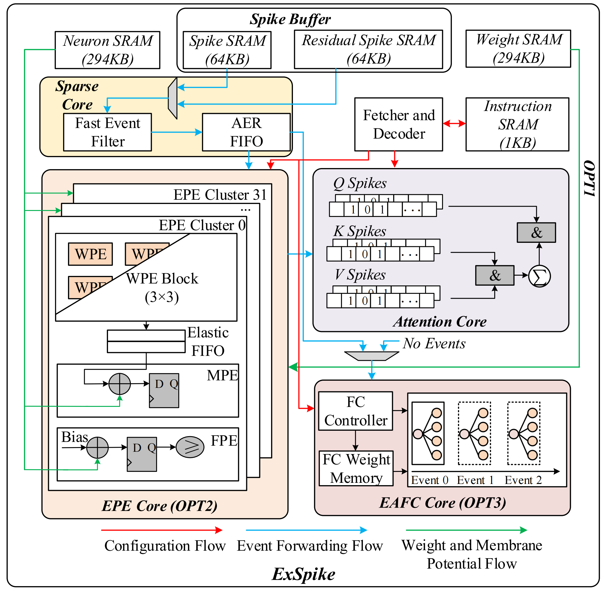

# ExSpike: A General Full-Event Neuromorphic Architecture for Exploiting Irregular Sparsity with Event Compression (FPL 2026)

> Copyright (C) 2025–2026, University of Groningen, the Netherlands.

> The digital HDL source code of ExSpike is released under the Solderpad Hardware License, Version 2.0, which extends the Apache License 2.0 for hardware use. You may redistribute and/or modify the HDL source code under the terms of this license.

> Additional files and source data are available on Zenodo: https://zenodo.org/records/20600138

# 📖 Repository Introduction

<p align="center">
  
</p>

```
ExSpike 🔥
    --AE_scripts  // automated scripts for artifact generation
    --Artifacts   // output of artifacts
    --cycle_model // cycle-level execution model for ExSpike
    --Evaluation  // FPGA runtime test
    --HW          // FPGA bitstream generation
    --Log         // FPGA runtime test log
    --Power_estimation // including SAIF files and netlists
    --rtl         // RTL for ExSpike ⭐
    --SIM         // simulation required files
    --xsim        // simulation repository
    sourceme      // defines the required paths for evaluation
    README.md     // AE guidelines
```

# 🚀 Evaluation Steps

```
1. Preparation of the Python environment
    install python 3.8.10
    pip install typing_extensions==4.12.2
    pip install torch==2.4.1 torchvision==0.19.1 --index-url https://download.pytorch.org/whl/cpu --no-deps
    pip install -r requirements.txt

2. sourceme file: please change the paths in the sourceme file, especially the Python path and the Vivado path, and **source sourceme**.

3. FAST evaluation
    source sourceme
    ./AE_scripts/run_all_artifact_fast.sh

4. FULL evaluation
    source sourceme
    ./AE_scripts/run_ae_clean.sh --force --deep  # deletes all running logs except the provided logs
    - 💡 If you have a target FPGA board, run:
      ./AE_scripts/run_all_artifact_full.sh
    - 💡 If you do not have a target FPGA board, run:
      ./AE_scripts/run_all_artifact_full.sh --no-fpga
      
📌 The following steps are optional.
5. All figures re-generation
    source sourceme
    ./AE_scripts/run_ae_figures.sh full

6. Power estimation
    source sourceme
    ./AE_scripts/run_ae_power.sh full

7. All tables re-generation
    source sourceme
    ./AE_scripts/run_ae_table1.sh
    ./AE_scripts/run_ae_table2.sh
```


